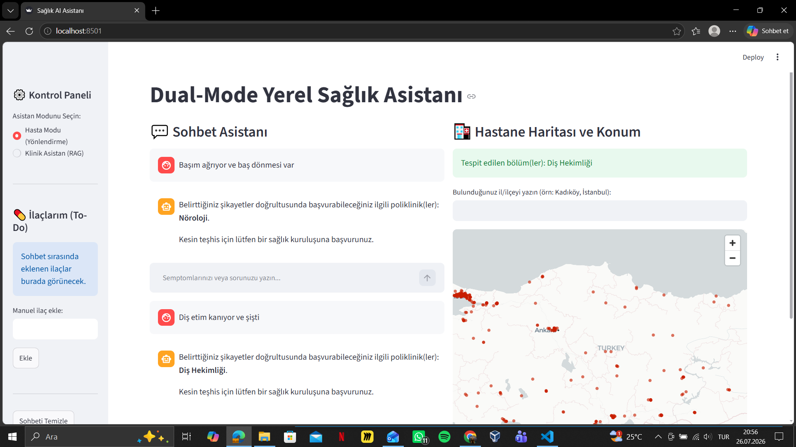
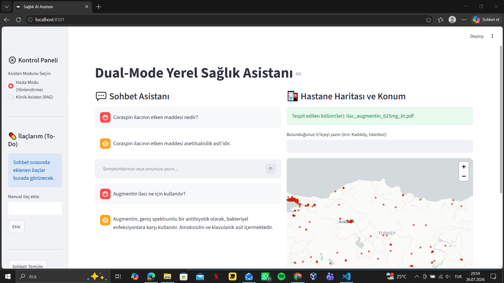
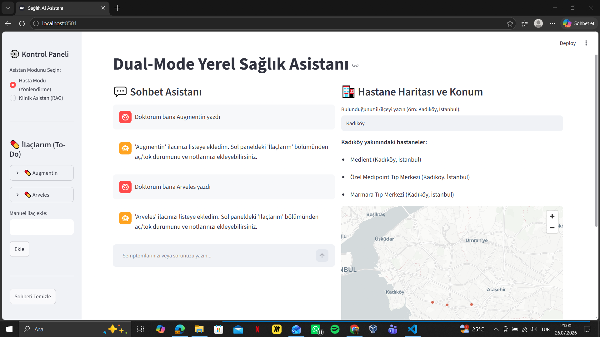
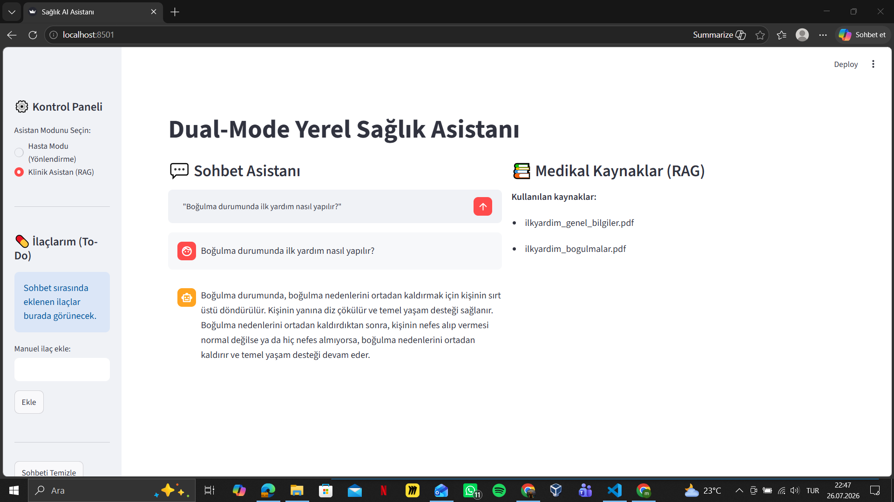
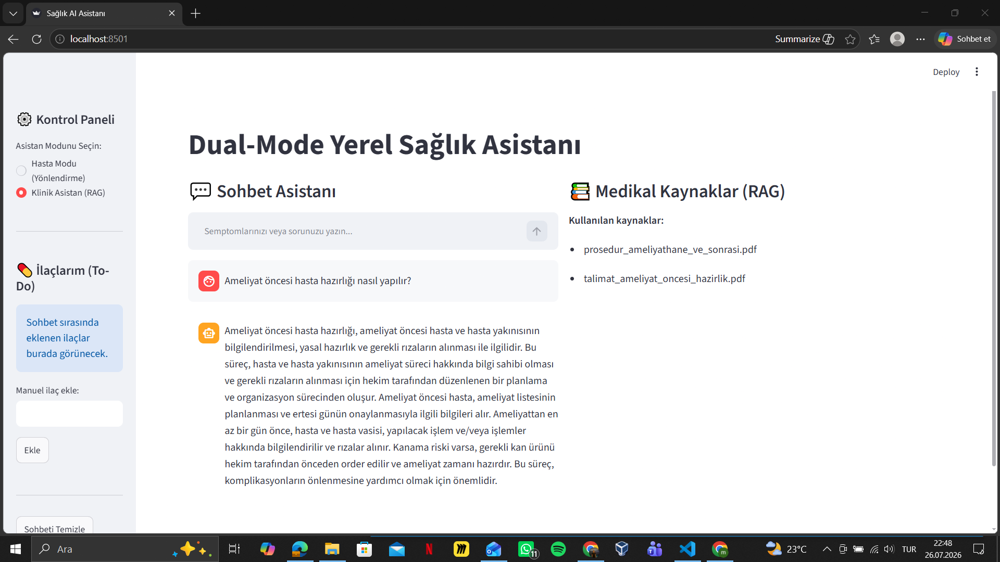
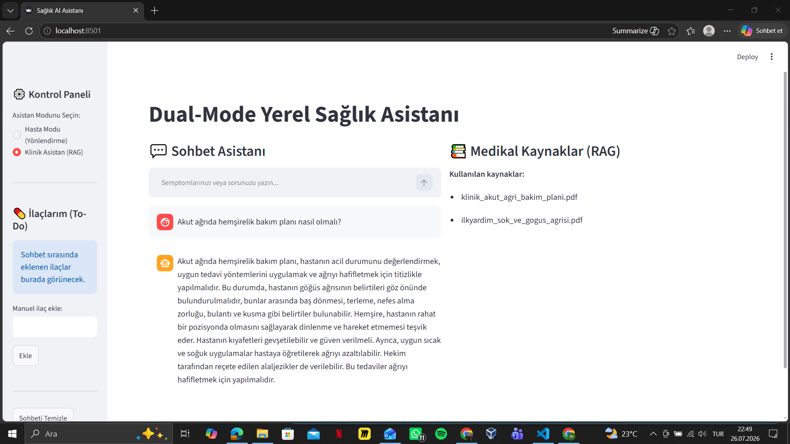
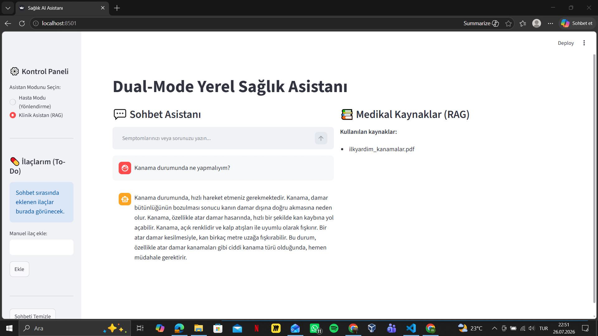

# 🏥 ClinicaAI — Dual-Mode Local RAG Health Assistant

**Microsoft AI Innovators Summer Internship — Foundry Local Projesi**

İnternet bağlantısı olmadan, tamamen lokalde çalışan, çift modlu bir sağlık AI asistanı. Microsoft Foundry Local ile çalıştırılan yerel bir dil modeli (Phi-4-mini) ve SQLite tabanlı bir RAG (Retrieval-Augmented Generation) mimarisi kullanır.

## 📋 Proje Hakkında

Bu proje, iki farklı kullanıcı grubuna hizmet eden çift modlu bir yapıya sahiptir:

- **🧑 Hasta Modu** — Semptom bazlı poliklinik yönlendirmesi, ilaç bilgisi sorgulama, ilaç hatırlatıcı (to-do listesi) ve konuma göre hastane arama
- **🩺 Klinik Asistan Modu** — Hemşirelik bakım planları, ameliyat prosedürleri ve ilk yardım konularında kaynakça gösteren, doküman tabanlı uzman asistan

Projenin en temel kısıtı: **tüm işlemler internete bağlanmadan, tamamen kullanıcının kendi bilgisayarında çalışır.**

## ✨ Özellikler

### Hasta Modu
- Semptom girişine göre otomatik poliklinik/branş yönlendirmesi
- İlaç sorgulama (etken madde, kullanım amacı) — yüklü KT/KÜB dokümanlarından RAG ile
- Sohbet sırasında algılanan ilaçları otomatik "İlaçlarım" listesine ekleme
- İl/ilçeye göre en yakın hastaneleri listeleme ve harita üzerinde gösterme

### Klinik Asistan Modu (RAG)
- Hemşirelik bakım planları, ameliyat prosedürleri ve ilk yardım dokümanlarından embedding tabanlı anlamsal arama
- Her cevapta kullanılan kaynak dokümanın adını gösterme (kaynakçalı yanıt)
- Halüsinasyonu azaltmak için yalnızca sağlanan bağlama dayalı cevap üretimi

## 🛠️ Kullanılan Teknolojiler

| Katman | Teknoloji |
|---|---|
| Yerel LLM | [Microsoft Foundry Local](https://learn.microsoft.com/azure/ai-foundry/foundry-local/) (Phi-4-mini) |
| Veritabanı | SQLite + [sqlite-vec](https://github.com/asg017/sqlite-vec) (vektör arama) |
| Embedding | `sentence-transformers` (paraphrase-multilingual-MiniLM-L12-v2) |
| Arayüz | Streamlit |
| PDF İşleme | pypdf |
| Coğrafi Kodlama | geopy (Nominatim) |
| Veri Kaynağı (Hastaneler) | OpenStreetMap (Overpass API) |

## 📂 Proje Yapısı

```
ClinicaAI/
├── app.py                          # Streamlit ana arayüz + model entegrasyonu
├── hastane.py                      # Ham OSM verisini SQLite'a aktarma
├── adres_bul.py                    # Eksik il/ilçe bilgisini coğrafi kodlama ile tamamlama
├── db/
│   └── database.py                 # SQLite şeması (dokuman_chunklari, vec_chunklari, semptom_brans, ilaclar)
├── rag/
│   └── ingest.py                   # PDF/CSV verilerini okuyup embedding ile veritabanına aktarma
├── data/
│   ├── klinik/                     # Hemşirelik bakım planı PDF'leri
│   ├── prosedur/                   # Ameliyat prosedürü PDF'leri
│   ├── ilkyardim/                  # İlk yardım PDF'leri
│   ├── ilaclar/                    # İlaç KT/KÜB PDF'leri
│   └── semptom_brans/              # Semptom-branş eşleşme tablosu (CSV)
├── hastaneler.db                   # SQLite veritabanı (hastane verisi + RAG verileri)
└── requirements.txt
```

## 🚀 Kurulum ve Çalıştırma

### 1. Foundry Local'i kurun

```bash
winget install Microsoft.FoundryLocal
```

### 2. Modeli indirip çalıştırın

```bash
foundry run phi-4-mini
```

> **Not (GPU/CUDA sorunu yaşarsanız):** Geliştirme sürecinde, bazı NVIDIA GPU'larda (örn. 4GB VRAM'li dizüstü GPU'lar) CUDA execution provider ile `phi-4-mini` çalıştırılırken bellek/sürücü uyumsuzluğundan kaynaklanan çökmeler (`CUDA error: device kernel image is invalid`) gözlemlendi. Bu durumda modelin **CPU sürümünü** kullanmak sorunu çözmektedir:
> ```bash
> foundry run Phi-4-mini-instruct-generic-cpu
> ```
> CPU sürümü biraz daha yavaş çalışır ancak stabildir ve GPU sürücü uyumluluğu gerektirmez — bu proje için CPU sürümü tercih edilmiştir.

### 3. Python ortamını hazırlayın

```bash
python -m venv .venv
.venv\Scripts\Activate.ps1
pip install -r requirements.txt
```

### 4. Veritabanını oluşturun ve verileri işleyin

```bash
python db/database.py
python rag/ingest.py
```

### 5. Uygulamayı başlatın

```bash
streamlit run app.py
```

Tarayıcıda otomatik olarak `http://localhost:8501` açılacaktır.

## 📸 Ekran Görüntüleri

### Hasta Modu — Semptom → Branş Yönlendirmesi


### Hasta Modu — İlaç Bilgisi ve To-Do Listesi


### Hasta Modu — İlaç Listesi ve Hastane Haritası


### Klinik Asistan Modu — Boğulma (İlk Yardım)


### Klinik Asistan Modu — Ameliyat Prosedürü


### Klinik Asistan Modu — Hemşirelik Bakım Planı


### Klinik Asistan Modu — Kanamalar (İlk Yardım)


## 🧪 Test Süreci

Proje, hem Hasta Modu hem de Klinik Asistan Modu için sistematik olarak test edilmiştir. Test edilen kategoriler:

| Kategori | Örnek Sorgu | Sonuç |
|---|---|---|
| Semptom → Branş yönlendirmesi | "Başım ağrıyor ve baş dönmesi var" | ✅ Doğru branş (Nöroloji) tespit edildi |
| İlaç bilgisi (RAG) | "Coraspin ilacının etken maddesi nedir?" | ✅ Doğru ve kaynağa dayalı cevap |
| İlaç to-do listesi | "Doktorum bana Augmentin yazdı" | ✅ Otomatik listeye eklendi |
| Konum bazlı hastane arama | "Kadıköy" | ✅ İlgili hastaneler listelendi ve haritalandı |
| Klinik doküman RAG | "Boğulma durumunda ilk yardım nasıl yapılır?" | ✅ Kaynağa dayalı, doğru prosedür |
| Cevaplanamayan/eksik bilgi durumu | Veritabanında karşılığı olmayan sorular | ✅ "Bilgi bulunamadı" şeklinde dürüst yanıt |

**Performans notu:** CPU üzerinde çalışan `phi-4-mini` modeli, ortalama 3-8 saniye içinde yanıt üretmektedir (donanıma bağlı olarak değişir).

## ⚠️ Bilinen Sınırlamalar

- **Model boyutu:** `phi-4-mini` (3.6-4.8 GB) küçük bir yerel model olduğu için, doğrudan bilgi çekme sorularında (örn. *"X ilacının etken maddesi nedir?"*) güvenilir sonuçlar verirken, daha fazla sentezleme/yorumlama gerektiren sorularda (örn. *"X ne işe yarar?"*) zaman zaman tutarsız veya tekrarlı cevaplar üretebilmektedir. Bu, kaynak-kısıtlı yerel LLM'lerin bilinen bir sınırlamasıdır ve gelecek çalışmada daha büyük bir model (`phi-4`, `qwen2.5-7b` gibi) veya daha güçlü GPU donanımıyla iyileştirilebilir.
- **GPU/CUDA uyumluluğu:** Düşük VRAM'li (4GB) GPU'larda CUDA execution provider kararsızlık gösterdiği için proje CPU execution provider ile çalıştırılmaktadır (bkz. Kurulum bölümü).
- **Poliklinik verisi:** Hastane veritabanında (OpenStreetMap kaynaklı) her hastanenin sunduğu spesifik poliklinik/branş bilgisi bulunmamaktadır; bu nedenle hastane arama sadece il/ilçe bazlı çalışmaktadır.
- **Semptom-branş eşleştirmesi:** Klasik anahtar kelime/kök eşleştirmesi ile çalışır (embedding tabanlı değildir), bu basit ve önceden tanımlı eşleştirmeler için yeterli ve tercih edilen bir yaklaşımdır.

## 🎓 Öğrenilen Konular

- Microsoft Foundry Local ile tamamen offline LLM çalıştırma
- SQLite üzerinde `sqlite-vec` ile vektör/embedding tabanlı anlamsal arama (RAG)
- PDF dokümanlarından metin çıkarma, chunk'lama ve embedding üretimi
- Streamlit ile çok panelli, durum yönetimli (session state) interaktif arayüz geliştirme
- OpenAI-uyumlu API üzerinden yerel modellerle entegrasyon
- Küçük dil modellerinin (SLM) güçlü ve zayıf yönlerinin pratikte gözlemlenmesi

## 👤 Geliştirici

Mert Cihan Dönmez — Microsoft AI Innovators Summer Internship 2026

---

*Bu proje, Barbaros Günay (CSA Manager, CSU Turkey) yönetimindeki Microsoft AI Innovators Summer Internship kapsamında geliştirilmiştir.*
